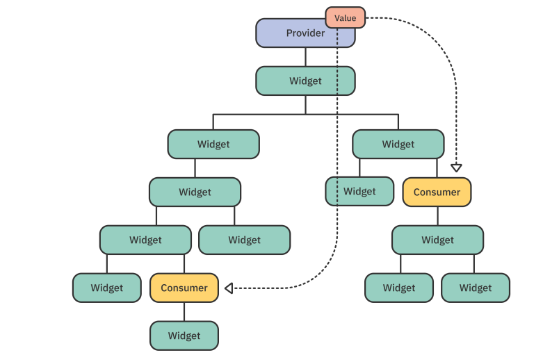

# STATE MANAGEMENT: Switching Tab 

There are two basic options: 

- Standard CallBack: 
  + Lần lượt phải truyền hàm callback vào các widget để chuyển state (data) giữa các Widget 

- **Provider**: 
 
 Code logic, rõ ràng, dễ bảo trì 

  
